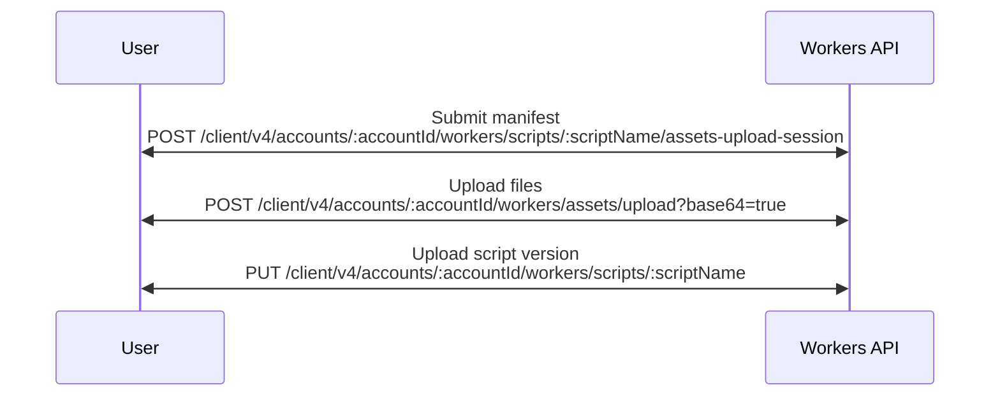

import {
	Badge,
	Description,
	FileTree,
	InlineBadge,
	Render,
	TabItem,
	Tabs,
} from "~/components";

:::note

Directly uploading assets via Worker APIs is an advanced approach that most users will not need. Instead, we encourage users to interact with these APIs through [Wrangler](/workers/static-assets/get-started/#1-create-a-new-worker-project-using-the-cli).

:::

The Workers API empowers users to upload and serve static assets. Users can also fetch assets through an optional [assets binding](/workers/static-assets/binding/). This guide will describe the process for attaching assets to your Worker directly through the Workers API.



The asset upload flow can be distilled into three distinct phases:

1. Registration of a manifest
2. Upload of the assets
3. Deployment of the Worker

## `Upload manifest`

The asset manifest is a ledger which keeps track of files we want to use in our Worker. This manifest is used to track assets associated with each Worker version, and eliminate the need to upload unchanged files prior to a new upload.

The manifest upload request describes each file which we intend to upload. Each file is its own key representing the file path and name, and is an object which contains metadata about the file.

`hash` represents the first 32 characters of the file's hash, while `size` is the size (in bytes) of the file.

```bash title="Example manifest upload request"
curl -X POST https://api.cloudflare.com/client/v4/accounts/:accountId/workers/scripts/:scriptName/assets-upload-session \
 --header 'content-type: application/json' \
 --header 'Authorization: Bearer API_TOKEN' \
 --data '{ "manifest": { "/filea.html": { "hash": "08f1dfda4574284ab3c21666d1", "size": 12 }, "/fileb.html": { "hash": "4f1c1af44620d531446ceef93f", "size": 23 } } }'
```

The resulting response will contain a JWT, which provides authentication during file upload. The JWT is valid for one hour.

In addition to the JWT, the response instructs users how to optimally batch upload their files. These instructions are encoded in the `buckets` field. Each array in buckets contains a list of file hashes which should be uploaded together.

```bash title="Example manifest upload response"
{
  "result": {
    "jwt": "<upload_token>",
    "buckets": [
      [
        "08f1dfda4574284ab3c21666d1",
				"4f1c1af44620d531446ceef93f"
      ]
    ]
  },
  "success": true,
  "errors": null,
  "messages": null
}
```

### `Limitations`

- Each file must be under 25 MiB
- The overall manifest must not contain more than 20,000 file entries

## `Upload Static Assets`

Users can upload assets by POSTing to https://api.cloudflare.com/client/v4/accounts/:accountID/workers/assets/upload?base64=true. This endpoint requires files be uploaded using multipart/form data. The contents of each file must be base64 encoded, and the `base64` query param must be set to `true`.

The authorization header must be provided as a bearer token, using the JWT (upload token) from the aforementioned manifest upload call.

Once every file in the manifest has been uploaded, a status code of 201 will be returned, with the `jwt` field present, and containing a final "completion" token which can be used in a deployment of a Worker with assets. This token is valid for 1 hour.

## `Create/Deploy New Version`

[Script](/api/operations/worker-script-upload-worker-module) and [version](/api/operations/worker-versions-upload-version) upload endpoints require specifying a metadata part in the form data. If this is a new Worker, we can provide the completion token from the previous (upload assets) step. This token will be validated by the backend to ensure that all assets have been uploaded.

```bash title="Example Worker Metadata Specifying Completion Token"
{
  "main_module": "main.js",
  "assets": {
    "jwt": "<completion_token>"
  },
  "compatibility_date": "2021-09-14"
}
```

If this is a worker which already exists with assets, and you wish to just re-use the existing set of assets, we do not have to specify the completion token again. Instead, we can provide the `keep_assets` metadata configuration.

```bash title="Example Worker Metadata Specifying keep_assets"
{
  "main_module": "main.js",
  "keep_assets": true,
  "compatibility_date": "2021-09-14"
}
```

Asset [routing configuration](/workers/static-assets/routing/#routing-configuration) can be provided in the assets object, such as `html_handling` and `not_found_handling`.

```bash title="Example Worker Metadata Specifying Asset Configuration"
{
  "main_module": "main.js",
  "assets": {
    "jwt": "<completion_token>",
    "config" {
      "html_handling": "auto-trailing-slash"
    }
  },
  "compatibility_date": "2021-09-14"
}
```

Optionally, an asset binding can be provided if you wish to fetch and serve assets from within your Worker.

```bash title="Example Worker Metadata Specifying Asset Binding"
{
  "main_module": "main.js",
  "assets": {
    ...
  },
  "bindings": [
    ...
    {
      "name": "ASSETS",
      "type": "assets"
    }
    ...
  ]
  "compatibility_date": "2021-09-14"
}
```

## `Programmatic Example`

<Tabs> <TabItem label="TypeScript" icon="seti:typescript">

```ts
import * as fs from "fs";
import * as path from "path";
import * as crypto from "crypto";
import { FormData, fetch } from "undici";

const accountId: string = ""; // Replace with your actual account ID
const authToken: string = ""; // Replace with your actual API token
const filesDirectory: string = "assets"; // Adjust to your assets directory
const scriptName: string = "my-new-script"; // Replace with desired script name

interface FileMetadata {
	hash: string;
	size: number;
}

interface UploadSessionData {
	uploadToken: string;
	buckets: string[][];
	fileMetadata: Record<string, FileMetadata>;
}

interface UploadResponse {
	result: {
		jwt: string;
		buckets: string[][];
	};
	success: boolean;
	errors: any;
	messages: any;
}

// Function to calculate the SHA-256 hash of a file and truncate to 32 bits
function calculateFileHash(filePath: string): {
	fileHash: string;
	fileSize: number;
} {
	const hash = crypto.createHash("sha256");
	const fileBuffer = fs.readFileSync(filePath);
	hash.update(fileBuffer);
	const fileHash = hash.digest("hex").slice(0, 32); // Grab the first 32 characters
	const fileSize = fileBuffer.length;
	return { fileHash, fileSize };
}

// Function to gather file metadata for all files in the directory
function gatherFileMetadata(directory: string): Record<string, FileMetadata> {
	const files = fs.readdirSync(directory);
	const fileMetadata: Record<string, FileMetadata> = {};

	files.forEach((file) => {
		const filePath = path.join(directory, file);
		const { fileHash, fileSize } = calculateFileHash(filePath);
		fileMetadata["/" + file] = {
			hash: fileHash,
			size: fileSize,
		};
	});

	return fileMetadata;
}

function findMatch(
	fileHash: string,
	fileMetadata: Record<string, FileMetadata>,
): string {
	for (let prop in fileMetadata) {
		const file = fileMetadata[prop] as FileMetadata;
		if (file.hash === fileHash) {
			return prop;
		}
	}
	throw new Error("unknown fileHash");
}

// Function to upload a batch of files using the JWT from the first response
async function uploadFilesBatch(
	jwt: string,
	fileHashes: string[][],
	fileMetadata: Record<string, FileMetadata>,
): Promise<string> {
	const form = new FormData();

	fileHashes.forEach(async (bucket) => {
		bucket.forEach((fileHash) => {
			const fullPath = findMatch(fileHash, fileMetadata);
			const relPath = filesDirectory + "/" + path.basename(fullPath);
			const fileBuffer = fs.readFileSync(relPath);
			const base64Data = fileBuffer.toString("base64"); // Convert file to Base64

			form.append(
				fileHash,
				new File([base64Data], fileHash, {
					type: "text/html", // Modify Content-Type header based on type of file
				}),
				fileHash,
			);
		});

		const response = await fetch(
			`https://api.cloudflare.com/client/v4/accounts/${accountId}/workers/assets/upload?base64=true`,
			{
				method: "POST",
				headers: {
					Authorization: `Bearer ${jwt}`,
				},
				body: form,
			},
		);

		const data = (await response.json()) as UploadResponse;
		if (data && data.result.jwt) {
			return { completionToken: data.result.jwt };
		}
	});

	throw new Error("Should have received completion token");
}

async function scriptUpload(completionToken: string): Promise<void> {
	const form = new FormData();

	// Configure metadata
	form.append(
		"metadata",
		JSON.stringify({
			main_module: "index.mjs",
			compatibility_date: "2022-03-11",
			assets: {
				jwt: completionToken, // Provide the completion token from file uploads
			},
			bindings: [{ name: "ASSETS", type: "assets" }], // Optional assets binding to fetch from user worker
		}),
	);

	// Configure (optional) user worker
	form.append(
		"@index.js",
		new File(
			[
				"export default {async fetch(request, env) { return new Response('Hello world from user worker!'); }}",
			],
			"index.mjs",
			{
				type: "application/javascript+module",
			},
		),
	);

	const response = await fetch(
		`https://api.cloudflare.com/client/v4/accounts/${accountId}/workers/scripts/${scriptName}`,
		{
			method: "PUT",
			headers: {
				Authorization: `Bearer ${authToken}`,
			},
			body: form,
		},
	);

	if (response.status != 200) {
		throw new Error("unexpected status code");
	}
}

// Function to make the POST request to start the assets upload session
async function startUploadSession(): Promise<UploadSessionData> {
	const fileMetadata = gatherFileMetadata(filesDirectory);

	const requestBody = JSON.stringify({
		manifest: fileMetadata,
	});

	const response = await fetch(
		`https://api.cloudflare.com/client/v4/accounts/${accountId}/workers/scripts/${scriptName}/assets-upload-session`,
		{
			method: "POST",
			headers: {
				Authorization: `Bearer ${authToken}`,
				"Content-Type": "application/json",
				"Content-Length": Buffer.byteLength(requestBody).toString(),
			},
			body: requestBody,
		},
	);

	const data = (await response.json()) as UploadResponse;
	const jwt = data.result.jwt;

	return {
		uploadToken: jwt,
		buckets: data.result.buckets,
		fileMetadata,
	};
}

// Begin the upload session by uploading a new manifest
const { uploadToken, buckets, fileMetadata } = await startUploadSession();

// If all files are already uploaded, a completion token will be immediately returned. Otherwise,
// we should upload the missing files
let completionToken = uploadToken;
if (buckets.length > 0) {
	completionToken = await uploadFilesBatch(uploadToken, buckets, fileMetadata);
}

// Once we have uploaded all of our files, we can upload a new script, and assets, with completion token
scriptUpload(completionToken);
```

</TabItem> </Tabs>
